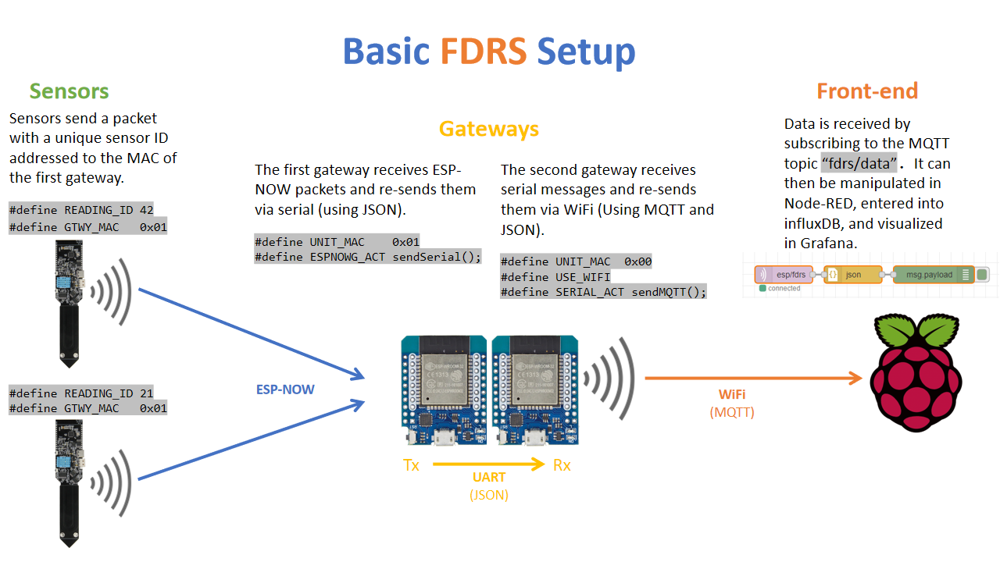
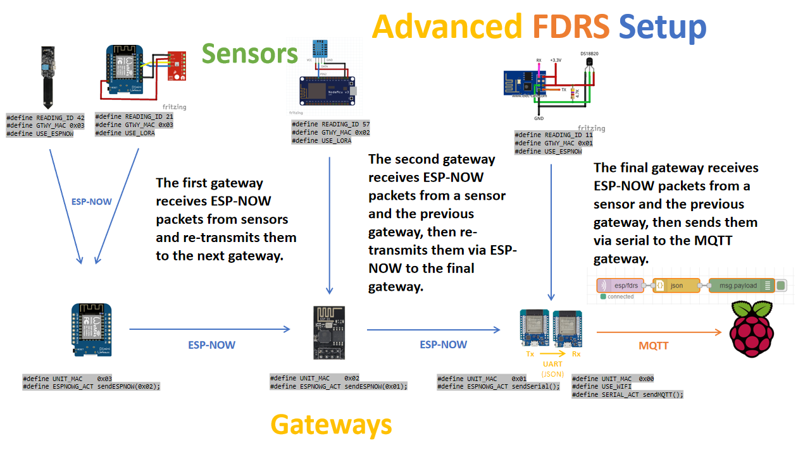
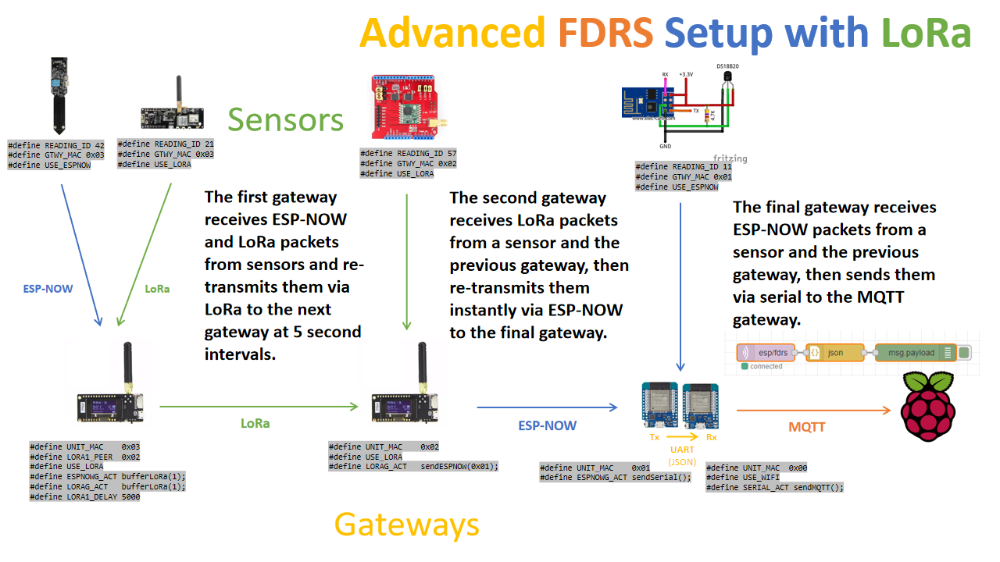

# FDRS Gateway
The FDRS Gateway listens for packets over ESP-NOW, UART, LoRa, and/or MQTT, then retransmits the packets over these interfaces using rules defined in the "Actions" section of the configuration file.

## Actions
Actions define how the gateway reacts to a packet received via each data source. An action may consist of one or multiple commands separated by (and terminated with) semicolons.

The following commands re-send data instantaneously: ```sendESPNOW(MAC)```, ```sendSerial()```, and ```sendMQTT()```.

These commands send data to buffers to be released at an interval: ```bufferLoRa(interface)```, ```bufferESPNOW(interface)```, ```bufferSerial()```, and ```bufferMQTT()```.

In this example, the gateway is set to take any ESP-NOW packet it receives and send it first over the serial port, then re-transmit it via ESP-NOW to another gateway with the address 0x01:
```
#define ESPNOWG_ACT sendSerial(); sendESPNOW(0x01);
```

## Options
### ```#define UNIT_MAC (0xNN)```
The UNIT_MAC is the ESP-NOW and LoRa address of the gateway. This is the address that nodes or other gateways will use to pass data to this device.
### ```#define FDRS_DEBUG```
This definition enables debug messages to be sent over the serial port. If disabled, the USB serial port is still used to echo data being sent via the sendSerial() command.
### ```#define RXD2 (pin)``` and ```TXD2 (pin)```
These are the pins for inter-device serial communication. The single ESP8266 serial interface is not configurable, and thus these options only apply to ESP32 boards. 

### ```#define USE_ESPNOW```
Enables ESP-NOW.
USE_ESPNOW and USE_WIFI must not be activated at the same time! 

### ```#define USE_LORA```
Enables LoRa. Make sure that you set the LoRa module configuration parameters in the lines below.

LORA_BAND and LORA_SF (spreading factor) can also be configured in 'fdrs_globals.h' if enabled.
### ```#define USE_WIFI```
Enables WiFi. Used only on the MQTT gateway.

SSID, password, and MQTT credentials are also configurable in 'fdrs_globals.h'.
### ```#define USE_SD_LOG```
Enables SD-card logging. Used only on the MQTT gateway if sending the MQTT message fails. Make sure to set the correct SD_SS (chip/slave select) pin in the lines below.

Logging is done in the following CSV Format: ```timestamp,reading_id,datatype,value```

Thanks to [@thefeiter](https://github.com/thefeiter) for this feature!


### ```#define USE_LED```
This option initializes FastLED! I haven't developed this very much, perhaps you have ideas?

## Peers
### Routing
In addition to reacting to packets from general (unknown) ESP-NOW and LoRa devices, the gateway can also listen for traffic from a specific peer's device address (MAC) and react differently than it would to general traffic. This can be used to 'propel' packets upstream or downstream and allows the user to define different paths for data originating from either direction. The user can define up to two peer addresses each for the ESP-NOW and LoRa interfaces (ESPNOW1 & ESPNOW2 and LORA1 & LORA2).
### Buffers
Each peer also has a send buffer associated with it. Buffers are enabled by uncommenting their corresponding DELAY macro (ex: ```#define LORAG_DELAY 1000```). When enabled, the gateway will automatically send the buffer contents at the interval specified. 

While ESP-NOW is quick enough to handle a lot of traffic in real-time, LoRa is much slower. For this reason, you must send LoRa data to a buffer. Since buffers are mandatory, a LoRa repeater always needs to be configured using a LoRa peer.

Buffers can hold a maximum of 256 DataReadings. 








